# Smart Light:基于微信ESP32控制的智能家居系统

## 想法说明

嵌入式设备已经深入我们的生活。然而，其控制显得非常繁琐复杂。如果我们能把其控制都用微信一个软件来完成，这样会不会很好呢？按照这个想法的指引，我们设计了一个智能家居系统，并且给出了初步的实现。

## 项目的架构

我们要实现智能硬件本身。这里，我们要做一个可控的LED灯。我们还要从底层实现了一个控制硬件（LED灯）的控制装置，用ESP32做硬件。这个控制硬件的装置是最难实现的，不光要在上面做软件，还用写和硬件交互的device driver。我们还要实现一个可以接收微信的指令，并且传递给硬件控制器的中控服务器装置。系统的体系结构如图：

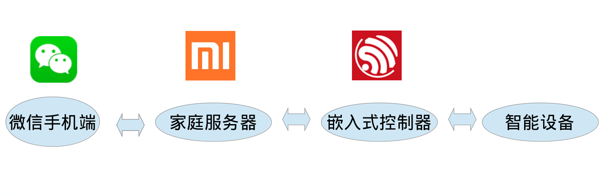

我们将分别说明这几部分的实现。

## ESP32硬件控制部分

### ESP32简介

ESP32是一款WiFi和蓝牙系统级芯片（SoC），集成了完整的发射/接收射频功能。

ESP32带有2个32位、LX6 CPU,主频高达240MHz，采用7级流水线架构。

此芯片还带有丰富的外设，包括UART、SPI、I2C等通用的串行传输硬件单元，ADC和DAC，电容式触摸传感器、SDSDIO/MMC主控制器、PWM和RMT，以及EMAC以太网RMII接口控制器。

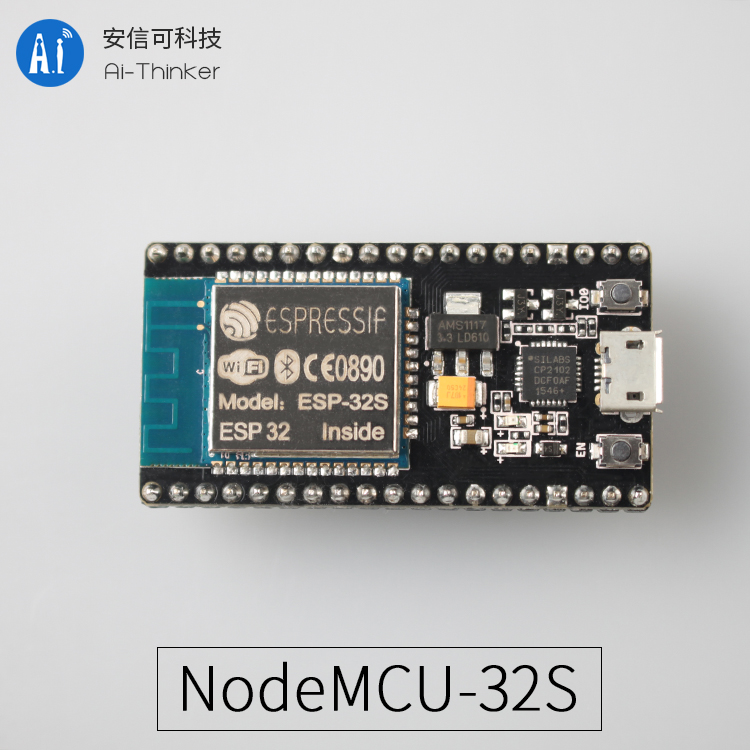

作为对比，STM32单片机高端F7系列的硬件性能为216MHz，512KB RAM，2M Flash，462 DMIPS，STM32F767IGT6的价格为75元左右，而240MHz双核，520KB SRAM，4M Flash，600DMIPS的ESP32邮票孔版本仅为26元，且自带WIFI蓝牙模块，性价比非常高。

项目采用ESP32开发板，价格为39元。

### 模块概述

为了合理利用ESP32的性能和外设，我们采用了FreeRTOS实时操作系统。与Linux系统不同的是，FreeRTOS近提供了任务调度和硬件控制的若干API，而并没有任务默认运行，没有Shell也没有各种Service，而这些都需要我们来实现。我们参考了若干例程，最终根据我们的需要实现了下面的功能：

1. 开机自动配置联网，由于我们的定位是智能家居，家庭里面的WIFI资源一般是固定的，不需要频繁改动
2. 配置联网后默认开启HTTP服务器（由我们自己实现的简单服务器）任务
3. 执行开机启动脚本，此脚本可以通过shell来更改，默认为空

图的表达为：

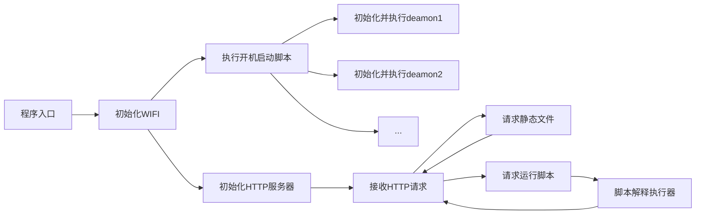

### 模块实现细节

#### HTTP服务器实现

使用嵌入汇编+Makefile的方式，避免了将html文本转为c字符串的操作：

```c
extern const char INDEX_HTML[] asm("_binary_index_html_start");
extern const char INDEX_HTML_END[] asm("_binary_index_html_end");
extern const char TEST_HTML[] asm("_binary_test_html_start");
extern const char TEST_HTML_END[] asm("_binary_test_html_end");
extern const char FAVICON_ICO[] asm("_binary_favicon_ico_start");
extern const char FAVICON_ICO_END[] asm("_binary_favicon_ico_end");

extern const char ERR_404_HTML[] asm("_binary_404_html_start");
extern const char ERR_404_HTML_END[] asm("_binary_404_html_end");
```

编写实现如下的HTTP函数。我们经过分析后认为HTTP协议本身作为包传输协议并不十分高效，而其好处就在于Header的信息是可读的，这方便了调试，更方便了扩展（非固定包头长度）。而它也有相应的局限性，最明显的地方就在于“客户-服务器”模型就确定了服务器不能主动发信息客户，而实际上在智能家居里面，传感器向我们发送信息是很常见的，对等的关系应该更贴切一些，于是我们实现了双向HTTP协议，两侧都可以向对方”问话“，而另一方则”尽可能马上回答“。在这样一个模型中，智能家居控制器可以像很多个”人”一样工作，随时都会有某个“人”告诉用户一些事情，用户也可以选择和某个“人”进行对话。

```c
struct DuHttp
{
    UINT8 type;
    char data[DUHTTP_DATASIZE];
    char* content;
    int contentLength;
    int headlineCount;
    struct {
    	char* key;
    	char* value;
	} headline[DUHTTP_MAXHEADLINECOUNT];
    union {
        struct {
			char requestedURL[128];
		} ask;
        struct {
    		int statusCode;
    		char reasonPhrase[32];
		} response;
    };
};
void DuHttp_Initialize(struct DuHttp* d);
void DuHttp_Initialize_GET(struct DuHttp* d, const char* requestedURL);
void DuHttp_Initialize_POST(struct DuHttp* d, const char* requestedURL);
void DuHttp_Initialize_RESPONSE(struct DuHttp* d, int statusCode, const char* reasonPhrase);
void DuHttp_Release(struct DuHttp* d);
char* DuHttp_FindValueByKey(struct DuHttp* d, const char* key);
void DuHttp_PushHeadline(struct DuHttp* d, const char* key, const char* value);
void DuHttp_PushData(struct DuHttp* d, const char* data, int dataLength);
void DuHttp_PushDataString(struct DuHttp* d, const char* str);
void DuHttp_EndHeadline(struct DuHttp* d);

struct DuHttpReceiver
{
#define DuHttpReceiver_State_RecevingHead 0
#define DuHttpReceiver_State_RecevingData 1
    int nowState;
    char headLineStr[DUHTTP_MAXLINESIZE];
    int headLineIndex;
    int hasReadDataLength;
    char queue[DUHTTPRECEIVER_BUFFERSIZE];
    int queue_write;
    int queue_read;
};

void DuHttpReceiver_Reset(struct DuHttpReceiver* r);
void DuHttpReceiver_Initialize(struct DuHttpReceiver* r);
char DuHttpReceiver_InBuf(struct DuHttpReceiver* r,
                          const char* buf, int bufsize);
char DuHttpReceiver_TryReadPack(struct DuHttpReceiver* r, struct DuHttp* pack);
void DuHttpReceiver_TryResolveHeadLine(const char* str, struct DuHttp* pack);
int DuHttpReceiver_AvailableSize(struct DuHttpReceiver* r);

int DuHttpSend(struct DuHttp* h, char* buf, int max_size);

char *url_decode(char *str);
```

同时对于网络的性能我们有一些优化，HTTP/1.0默认是每次进行传输结束后就关闭掉这个链接，我们调试阶段也同样是传输完成后就立即关闭，但通过少许改动就可以实现长连接传送多个包。

```c
DuHttp_PushHeadline(&sendDuHttp, "Connection", "keep-alive");
```

#### 运行程序模块

Shell本身不具备特殊的功能，而仅仅是把字符串转化成函数调用。当只有简单地几个函数的时候，简单地执行即可，然而我们希望实现一套可插件化拓展的功能，就不得不进行一些优雅的封装。

在Apache服务器中可以使用CGI程序来实现各种功能，而因为FreeRTOS没有一套动态执行程序的机制，我们实现了这个shell来支持有限的一些命令，并编写了驱动类（因为交叉编译器不支持C++，即使支持C++，在嵌入式系统中也尽量不用，会导致很多奇怪的问题），而对于c的函数式编程，又缺少封装而显得不优雅，于是我们将所有的
“类函数”描述成static的，并定义一个包含函数指针的struct，定义并初始化一个“驱动类”。

用我们这次使用的WS2812全彩LED灯举例：

```c
typedef struct
{
	uint8_t g;
	uint8_t b;
	uint8_t r;
} wsRGB_t;

struct ws2812_t_struct {
	unsigned char initialized;
	rmt_channel_t channel;
	gpio_num_t gpio;
	rmt_item32_t* items;
	unsigned int size;
};
typedef struct ws2812_t_struct ws2812_t;
void WS2812B_initStruct(ws2812_t* w);

struct WS2812B_Module {
	void (*init)(struct ws2812_t_struct* self);
	void (*setLeds)(struct ws2812_t_struct* self, wsRGB_t* data, unsigned int size);
	void (*deInit)(struct ws2812_t_struct* self);
	struct {
		void (*task)(void* pvParameters);
		rmt_channel_t channel; // = 0
		gpio_num_t PIN; // = 18;
		unsigned int CNT; // = 16;
		int duration; // = 10; (second)
	} demo;
};
extern struct WS2812B_Module WS2812B;
```

通过非常简单的封装，我们让c语言也拥有了“类成员函数”，通过这样一种方式，驱动可以结构化地保存信息，在有很多个驱动的时候，我们添加一个驱动模块就是调用`WS2812B.init(&ws2812)`函数，非常地简洁。

同样地，借鉴了Linux下面的daemon进程的观点，我们也编写了daemon函数，来实现复杂的时序逻辑。下面是WS2812的标准daemon：

```c
/* 这些函数是可以被别的Task调用的，异步和安全地改变LED的状态 */
extern int WS2812_daemon_SingleColor(wsRGB_t color, TickType_t delay);
extern int WS2812_daemon_Breathing(wsRGB_t color, TickType_t delay);
extern int WS2812_daemon_Rainbow(TickType_t delay);
extern int WS2812_daemon_Print(char* buf, size_t n);

/* 这些是daemon的执行函数 */
struct WS2812_state {
	TickType_t startTime;
	wsRGB_t pixels[pixel_count]; // using at
	int vec; // using as a bit set
	wsRGB_t para1;
	int para2;
	int para3;
	wsRGB_t para4;
	int type;
}; typedef struct WS2812_state WS2812_state_t;
static void initStat(WS2812_state_t* stat);

static WS2812_state_t* nowStat = NULL;
static WS2812_state_t* nextStat = NULL;

static int callUpdate(ws2812_t* ws2812, WS2812_state_t* stat, WS2812_state_t* nxtstat) {
	if (nxtstat == NULL || xTaskGetTickCount() < nxtstat->startTime) {
		// keep in this state
		if (stat->type == Type_SingleColor) {
			callSingleColor(ws2812, stat);
		} else if (stat->type == Type_Breathing) {
			callBreathing(ws2812, stat);
		} else if (stat->type == Type_Rainbow) {
			callRainbow(ws2812, stat);
		}
	} else { // change to next state
		initStat(stat); // avoid loop
		return 1;
	}
	return 0;
}

static const char TAG[] = "WS2812 daemon";

void WS2812_daemon_task(void *pvParameters) {
	ESP_LOGI(TAG, "Task started");

	ESP_LOGI(TAG, "Running Initialization step");
	ws2812_t ws2812;
	ws2812.channel = WS2812B.demo.channel; // rmt channel is 0
	ws2812.gpio = WS2812B.demo.PIN;
	ws2812.size = WS2812B.demo.CNT;
	WS2812B.init(&ws2812);
	const TickType_t delay = 30 / portTICK_PERIOD_MS; // 30ms
	nowStat = malloc(sizeof(WS2812_state_t));
	nextStat = malloc(sizeof(WS2812_state_t));
	if (nowStat == NULL || nextStat == NULL) {
		ESP_LOGE(TAG, "Malloc failed");
		goto errorDeinit;
	}
	nowStat->startTime = 0;
	nextStat->startTime = 0;

	ESP_LOGI(TAG, "daemon Initialization finished");

	while (1) {
		if (callUpdate(&ws2812, nowStat, nextStat)) { // swap
			WS2812_state_t* tmp = nowStat;
			nowStat = nextStat;
			nextStat = tmp;
		}
		vTaskDelay(delay);
	}

errorDeinit:

	ESP_LOGI(TAG, "Running Deinitialization");
	WS2812B.deInit(&ws2812);

	ESP_LOGI(TAG, "Deleting Task Handler");
	vTaskDelete(NULL);
}
```

目前为止我们实现了支持定时操作的LED灯。

#### 开机启动脚本与文件系统

完成上述的工程已经是一个较为完整的操作系统，可以在此框架下实现各种复杂的功能，然而，与Linux系统还有个明显的缺陷，就在于它没有“文件系统”。文件系统的好处在于它的灵活性，就比如开机启动脚本，我们不希望每一次改变开机启动脚本都需要重新烧录程序，而想要想Linux一样，通过vim修改文件就可以。为了实现这个功能，我们需要解决Flash本身存在性能缺陷的问题：写入速度远远慢于读出速度，而写入寿命只有短短的10万次。那么给予Flash的固态硬盘是如何实现的呢？它的实现比较复杂，会将文件尽可能写在那些比较新的块上，于是整个Flash每个块被写的次数几乎相同，这样就极大地增加了寿命，并且，不会出现少量几个不可用的块导致文件出现错误。我们使用了vfs（虚拟文件系统），并用了wear-leveling优化Flash的写入。

#### 实现LED灯的驱动

WS2812是一种全彩LED灯珠（256 * 256 * 256色），它的优势在于只需要一个GPIO就可以控制1000个LED灯珠，并且每个的颜色都不相同。它的实现原理如下：

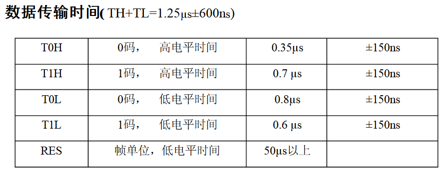

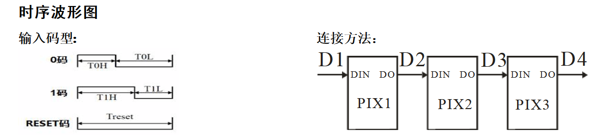

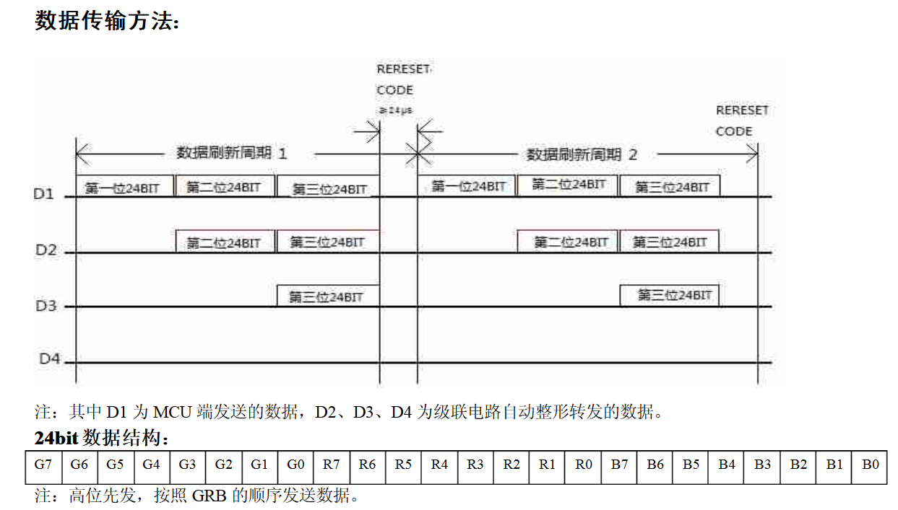

引脚封装为：

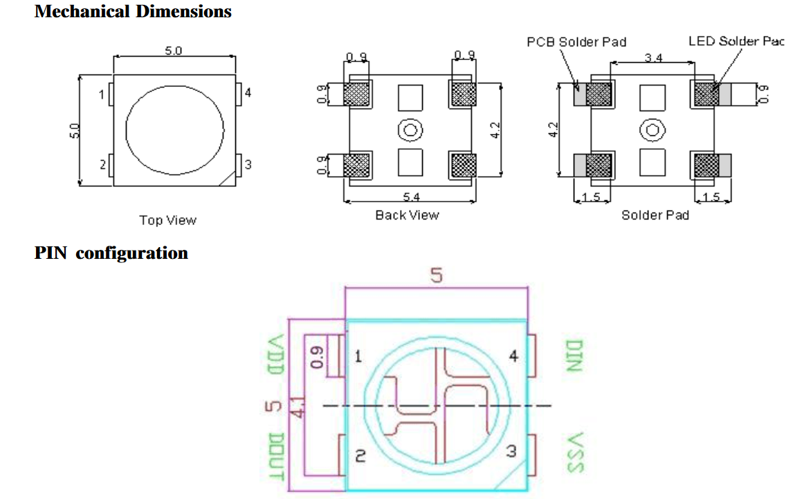

数据传输通过：吃掉一份数据，并将剩下的转发的方式实现了高速方便的控制。然而观察到时间的控制非常严格，达到了百ns的级别，已经是二十分之一的系统周期，如果控制灯就要让CPU一直在工作而不能被打断，这样一来操作系统就不能适用（它的GPIO操作封装可能会导致无法忍受的延时），为了解决这个难题，我们尝试了两种方式：增加一片外置的MCU和使用RMT控制器。

1. 我们采用了不带操作系统的STM32，使用UART来控制，STM32通过c语言内嵌汇编`__nop()`操作来调节延时，通过示波器调节到了20ns偏差的量级，但最终会有一些问题：STM32的串口中断会将发送打断，导致频繁改变的颜色会出现闪烁。
2. 采用RMT+DMA的方式，用ESP32自带的外设来实现。DMA（直接内存获取）可以在CPU不参与的情况下直接读取内存，非常适合耗时硬件外设的控制。RMT是红外的收发模块，可以编解码，其特点是信号的形状可以自定义（不像UART、SPI等已经是严格的标准）。使用DMA的RMT可以以非常高的速度来改变GPIO，这样一来就可以控制WS2812了。

STM32的程序

```c
#define func(R) setWS(1); \
if(R & 0x80){__nop(); __nop(); __nop(); __nop(); __nop(); __nop(); __nop(); __nop(); __nop(); __nop(); __nop(); __nop(); __nop(); \
	__nop(); __nop(); __nop(); __nop(); __nop(); __nop(); __nop(); __nop(); __nop(); __nop(); __nop(); __nop(); __nop(); setWS(0); \
	__nop(); __nop(); __nop(); __nop(); __nop(); __nop(); __nop(); __nop(); __nop(); __nop(); __nop(); __nop(); \
	__nop(); __nop(); __nop(); __nop(); __nop(); __nop(); } \
else {setWS(0);       __nop(); __nop(); __nop(); __nop(); __nop(); __nop(); __nop(); __nop(); __nop(); __nop(); __nop(); __nop(); __nop(); \
	__nop(); __nop(); __nop(); __nop(); __nop(); __nop(); __nop(); __nop(); __nop(); __nop(); __nop(); __nop(); __nop(); __nop(); __nop(); \
	__nop(); __nop(); __nop(); __nop(); __nop();} R <<= 1

void WS2812chars(char R, char G, char B) {
	func(G); func(G); func(G); func(G); func(G); func(G); func(G); func(G);
	func(R); func(R); func(R); func(R); func(R); func(R); func(R); func(R);
	func(B); func(B); func(B); func(B); func(B); func(B); func(B); func(B);
}
```

ESP32的程序

```c
void WS2812B_init(rmt_channel_t channel, gpio_num_t gpio, unsigned int size, rmt_item32_t** itemsp)	{
 	// ........
	rmt_config_t rmt_tx;
	memset(&rmt_tx, 0, sizeof(rmt_config_t));

	rmt_tx.channel = channel;
	rmt_tx.gpio_num = gpio;
	rmt_tx.mem_block_num = 1;
	rmt_tx.clk_div = 1;
	rmt_tx.tx_config.idle_output_en = 1;

	rmt_config(&rmt_tx);
	rmt_driver_install(rmt_tx.channel, 0, 0);
  	// ........
}
static void WS2812B_setLeds(wsRGB_t* data, unsigned int size, rmt_item32_t* items, rmt_channel_t channel) {
  	unsigned int itemCnt = 0;
	for(int i = 0; i < size; i++)
		for(int j = 0; j < 24; j++)
		{
			if(j < 8)
			{
				if(data[i].r & (1<<(7-j))) items[itemCnt++] = wsLogicOne;
				else items[itemCnt++] = wsLogicZero;
			}

			else if (j < 16)
			{
				if(data[i].g & (1<<(7 - (j%8) ))) items[itemCnt++] = wsLogicOne;
				else items[itemCnt++] = wsLogicZero;
			}
			else
			{
				if(data[i].b & (1<<( 7 - (j%8) ))) items[itemCnt++] = wsLogicOne;
				else items[itemCnt++] = wsLogicZero;
			}
		}
	rmt_write_items(channel, items, size * 24, false);
}
```

事实发现ESP32的程序工作得更稳定，其充分地利用了硬件外设。

## LED硬件部分

我们设计了一个外形独特的台灯，为了简化，它是没有底座的，贴在学习桌侧面的墙上，灯的角度可以通过步进电机改变，可以”摇头晃脑“地提醒人们。同时硬件上还留有LED显示屏。不过，这两个功能还没来得及添加。

### 3D打印外壳

我们设计了3D模型，并用3D打印机将其打印了出来

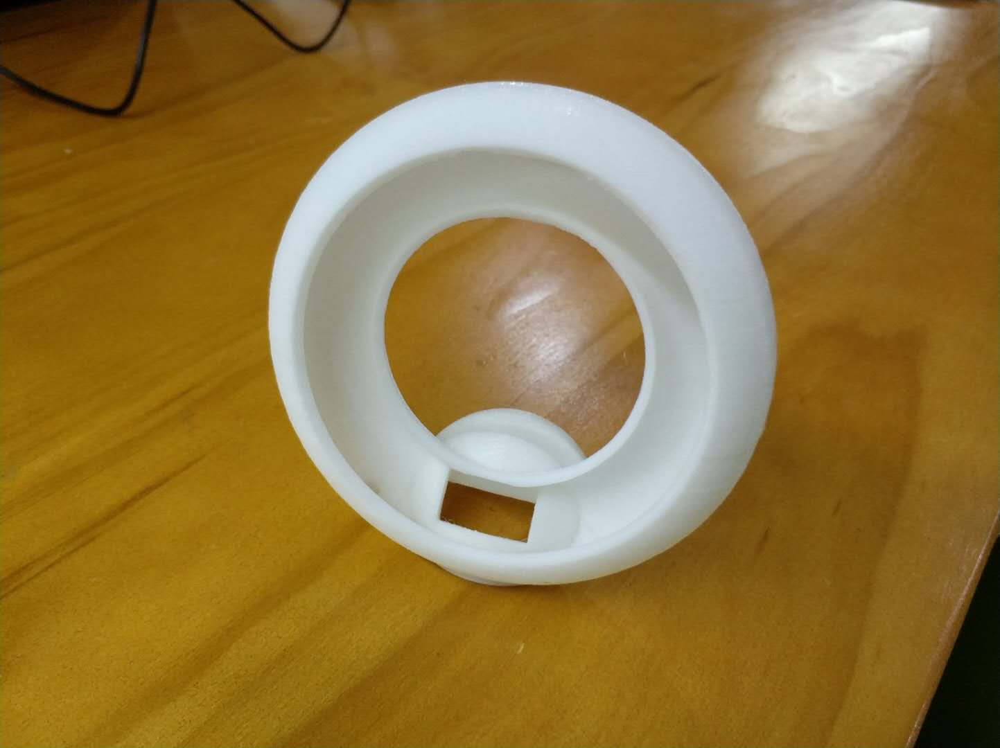

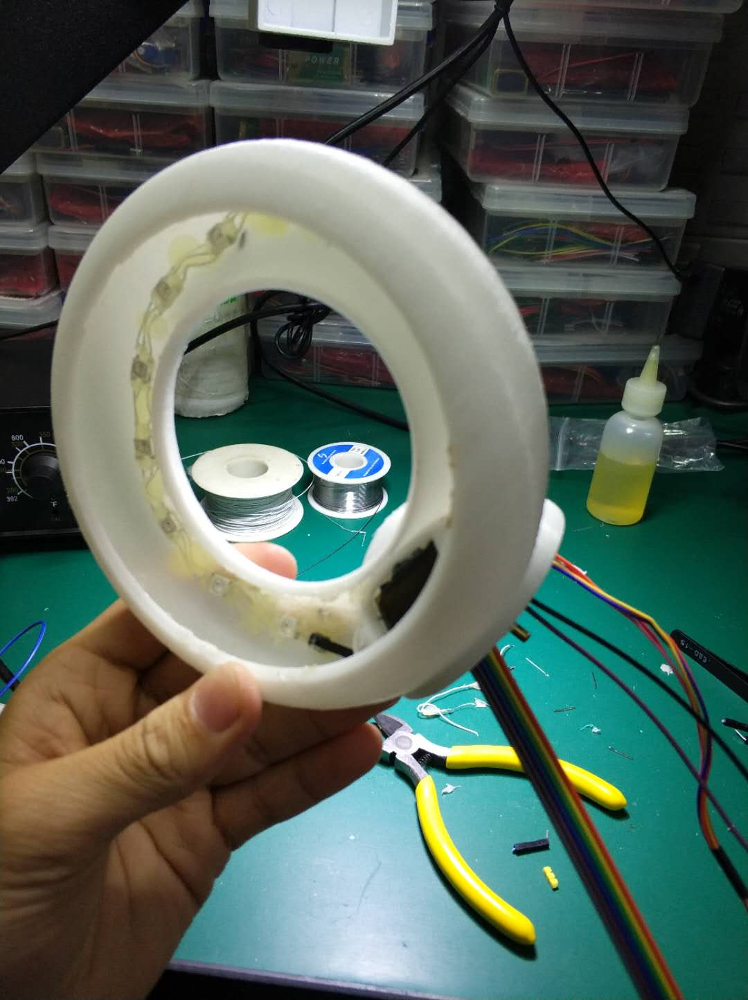

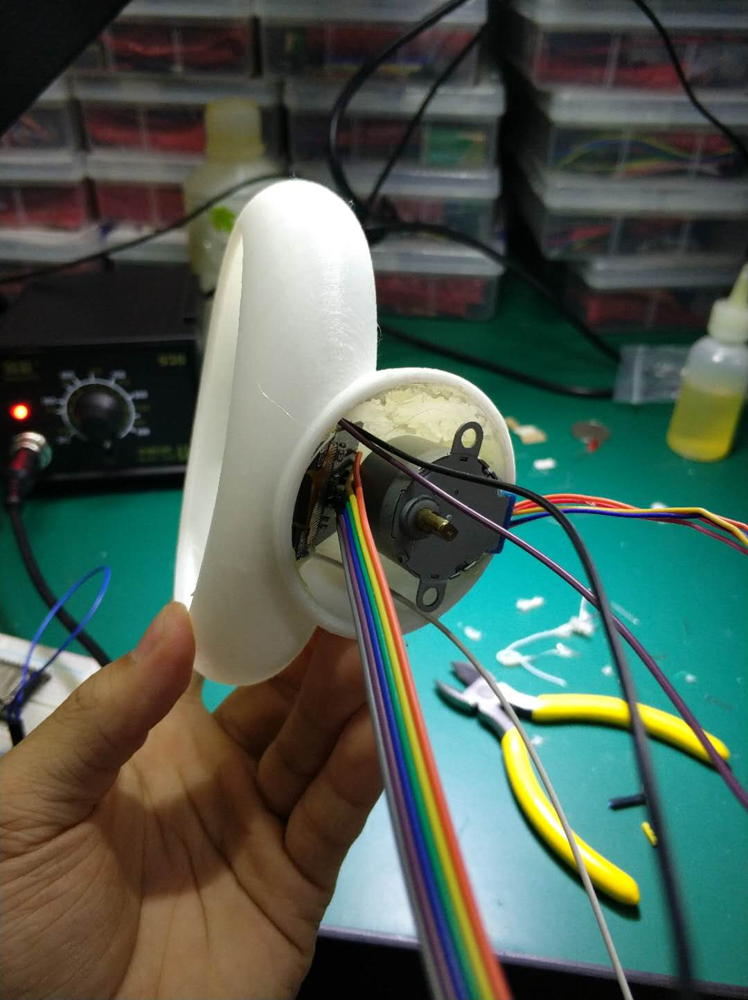

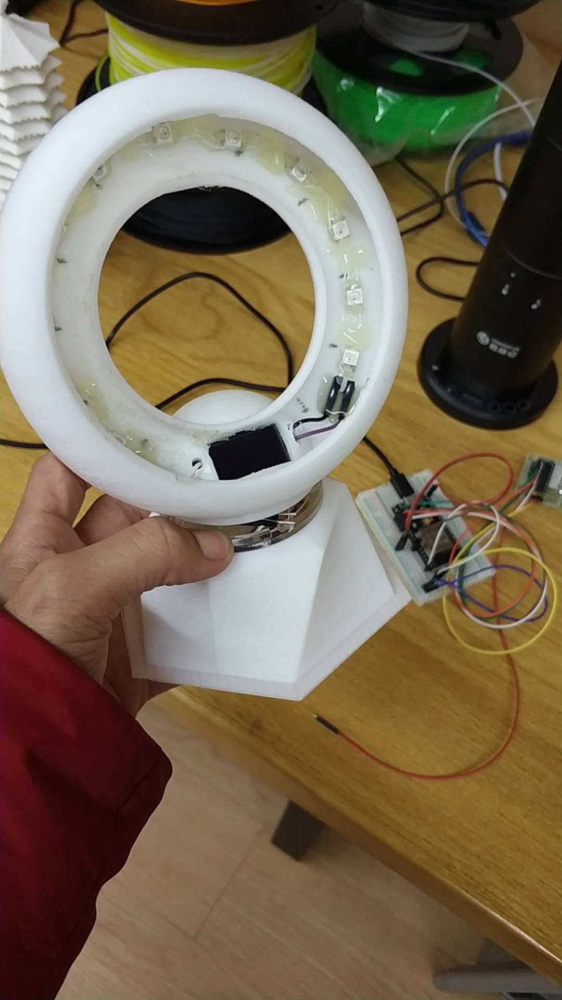

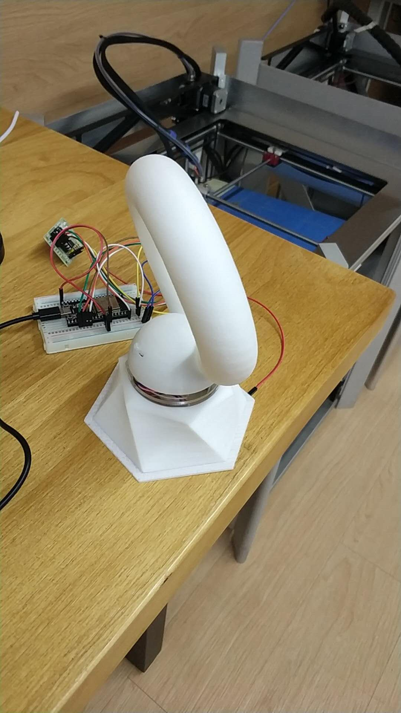

中间调试RMT的输出波形

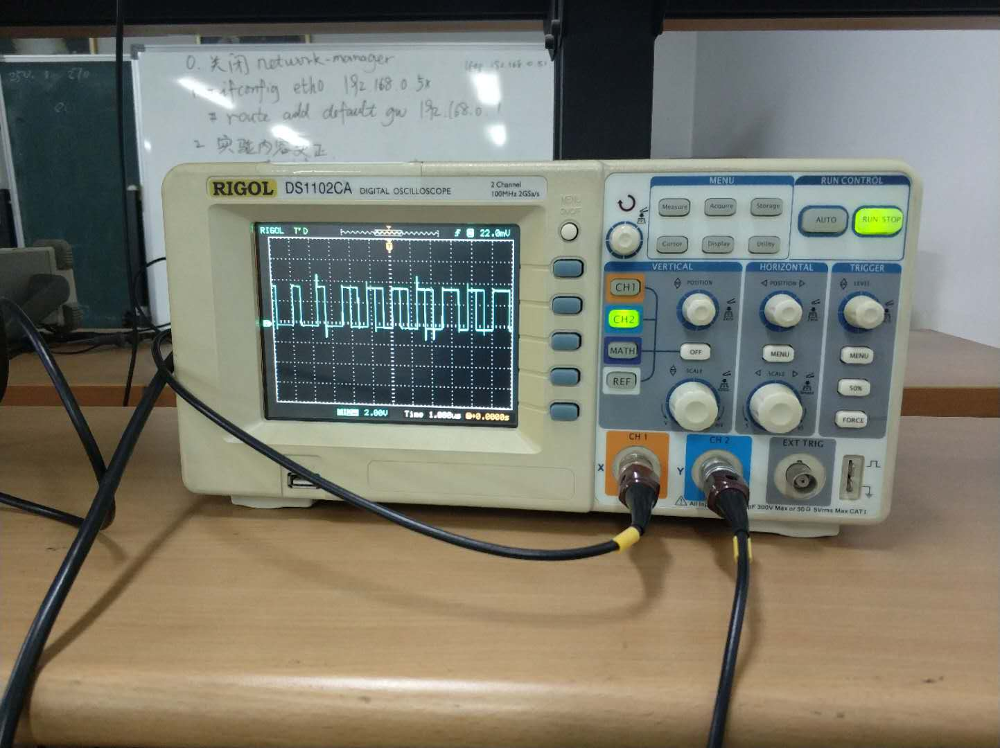


## 微信中控服务器部分

微信消息的收取，使用了Python3 itchat模块。itchat模块，是一个开源Python库，反向工程了微信网页版的API。这个API可以方便的发送和收取信息。他提供了一个装饰器函数，用来监视“消息寄存器”中的内容。通过在这个装饰器下面增加函数，可以处理来的消息。当然，也可以用这个模块发送消息。

整个中控的过程是围绕着一个shell为核心的，其功能体现在shell可以启动的一个个小程序上。微信把信息给shell,shell处理指令执行程序，把结果*非阻塞*地返回给微信。这个架构，可以方便功能的管理与添加，使整个程序显得更有逻辑，利于可拓展的模块化开发。

中控服务器的核心是一个shell：微信的消息集中放入一个队列缓冲区中，后台shell读实时取缓冲区中的指令。解析命令，如果现在没有正在执行的命令，用subprocess模块开启新的进程，拉起功能程序；否则，传递给正在运行的进程的stdin。如果命令没有得到识别，则把命令传递给一个灵活处理的模块（这个模块还没有实现，不会写AI...）。

对用户的输出与程序的运行是分离的。子程序的stdout输出被放入又一个缓冲区，每三分之一秒攒一波给微信。这样，不会出现程序没结束，于是输出全被阻塞着，最后攒一大波一起发的奇怪现象。注意，subprocess模块默认是阻塞的！只有带起的子程序运行完成才会返回输入值。我的解决方法是，把拉起来的子进程的stdout重定向到subprocess的PIPE中。这样，我就可以把其stdout当一个文件来读取。read方法是阻塞的，readline方法也是阻塞的。不过，readline的阻塞是针对一行而言的。如果程序没有执行完，然而输出了一行，则readline方法是可以获取这一行的信息的！这样，我就可以获得stdout的输入值了。

由于微信消息的推送时延比较大（几秒的量级），所以，模仿shell的实时发送没有意义。这样“攒一波”在发，比较高效，也可以避免用户“被刷屏”（使用shell时，我最讨厌一下子输出满屏幕调试信息的程序，让用户根本不知道发生了什么）。

### 与esp32之间的通信

这个很简单，直接使用http GET 请求就可以了，参数就用标准的方法传递。不过，有一个问题，就是设备的IP不好获取。目前采取的做法是在服务器端手动输入。如果服务器是在路由器上跑的话，可以写个程序自动获取同一网段下的IP，在微信端让用户选择。也可以在路由器的DHCP服务器上设定一下，固定esp32设备的IP地址。其实不固定也没关系。虽说是动态ip地址分配，其实实践中一般不会变的。我家里的iPad，没有设置，内网IP已经一年没有变化了。所以说这个问题实践中影响不大。

### 包管理

我们写了个简单的包管理软件。原因是，我们不希望不经过分析就调用系统中的二进制可执行文件，或者脚本。这样太不安全了，给注入等攻击手段留下了空间。

处理指令的时候，shell会看软件是否在alias列表中，如果在，就相应的执行程序，传递参数。不在的话，就给一个灵活处理的程序灵活处理。
```json
[
  {
      "cname" : "hello",
      "alias": ["hello","你好","hello_world", "shit"],
      "invoking_program" : ["python3", "./programs/hello/hello.py"],
      "version" : "1.0.0",
      "description": "Does nothing but say hello."
  },
  {
      "cname" : "whoami",
      "alias": ["我是谁"],
      "invoking_program" : ["sh", "./programs/whoami/main.sh"],
      "version" : "1.0.0",
      "description": "Does nothing but tells you who you are"
  },
  {
      "cname" : "turn_on_light",
      "alias": ["开灯", "灯","关灯"],
      "invoking_program" : ["python3", "./programs/turn_on_light/main.py"],
      "version": "0.1.0",
      "description" : "控制灯的亮灭"

  },
  {
      "cname" : "eecs_news",
      "alias": ["信科新闻", "eecs"],
      "invoking_program" : ["python3", "./programs/eecs_news/main.py"],
      "version": "0.1.0",
      "description" : "最近的信科新闻"

  },
  {
      "cname" : "async_demo",
      "alias": ["非阻塞", "非阻塞展示","async"],
      "invoking_program" : ["./programs/async_demo/main.sh"],
      "version": "1.0.0",
      "description" : "展示非阻塞的输出特性"
  }
]
```

您要想自己测试一下微信shell的话，直接运行`server.py`，按指示操作即可。默认是和自己的文件助手交互通信。退出的时候要多按依次ctrl C，我还没找到较好的退出方法。（毕竟要接连退出许多个线程）

## 展望与问题

我们还有许多可以做的事情：

- 增加LED灯的功能，用上舵机，显示器
- 别的智能家居，比如打印机。
- 增加一些实用程序，规范化软件开发架构

潜在的问题也不少：

- 微信服务器效率太低。如何少开线程？
- 登陆时如何获取微信二维码？时效性强，不能用邮件。
- 获取IP，穿透内网（微信好处就在于不用担心内网穿透的事情）
- 更便捷的ESP32开发。不过这个貌似没什么办法。
- 移植到路由器上。C语言移植？

希望以后有功夫的话能解决。

## 参考文献与网站

解决问题的时候比较着急，所以没有特别的记录用到的参考资料。主要是阅读有关软件以及框架的官方文档，比如Python的Docs（用的太多我都把它作为一个搜索引擎了），ESP32项目的tutorial，样例以及文档。

我们的代码都在github上面。[吴越同学的帐号](https://www.github.com/wuyuepku)，[孟逸白同学的帐号](https://www.github.com/YibaiMeng)。欢迎老师前去查看。